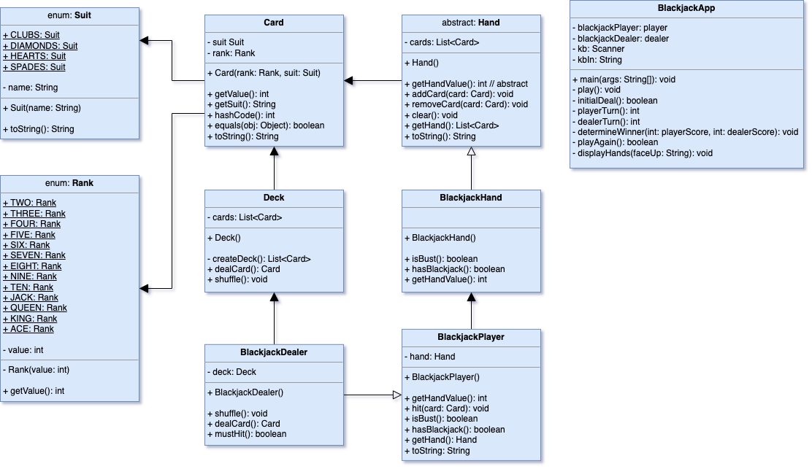

# BlackJackProject

## Description
Classes and test app to play a functioning game of blackjack.

## Usage
User is prompted to hit or stay on the initial hand they are presented.
Once they choose to stay, the dealer hits and then stays as dictated by standard blackjack rules.
The winner is then displayed along with the dealer's full hand.

### Usage Constraints
Aces are only valued at 11 and not with the optional value of 1.

### Display Output
- Start message
- Option to hit or stay
- Player's hand of cards
- Dealer's hand of cards with first card face down
- Winner
- Winning hands (dealer's face up)

###### Output Example
```formatted output
============================
-=* Welcome to Blackjack *=-
============================
-=*   Ace value is 11    *=-
-=*    Single Player     *=-
-=*     Single Deck      *=-
-=*      No Doubles      *=-
-=*      No Splits       *=-
-=*       No Bets        *=-
-=*   Drinks are Free    *=-
============================
* Starting Game *
* Dealer Shuffles *
* Dealer Begins Dealing *

Player's Hand: [FIVE of Hearts, TWO of Hearts] (7)
Dealer's Hand: [*FACE DOWN*, FOUR of Diamonds]

* Hit or Stay? *
h
* Player Hits *

Player's Hand: [FIVE of Hearts, TWO of Hearts, NINE of Diamonds] (16)
Dealer's Hand: [*FACE DOWN*, FOUR of Diamonds]

* Hit or Stay? *
h
* Player Hits *

Player's Hand: [FIVE of Hearts, TWO of Hearts, NINE of Diamonds, FIVE of Spades] (21)
Dealer's Hand: [*FACE DOWN*, FOUR of Diamonds]

* Hit or Stay? *
s
* Player Stays *
* Dealer Hits *

Player's Hand: [FIVE of Hearts, TWO of Hearts, NINE of Diamonds, FIVE of Spades] (21)
Dealer's Hand: [*FACE DOWN*, FOUR of Diamonds, EIGHT of Hearts]

* Dealer Busts *

Player's Hand: [FIVE of Hearts, TWO of Hearts, NINE of Diamonds, FIVE of Spades] (21)
Dealer's Hand: [QUEEN of Hearts, FOUR of Diamonds, EIGHT of Hearts] (22)

* Player Wins *

* Would you like to play again? *
n

* Thanks for playing * 
``` 

## Technologies Used
- Java 8
- Eclipse AArch64
- MacOS on Silicon
- Git
- GitHub
- Slack
- Discord 
- (Google)

## Topics
- Building object-oriented classes
- Building classes with object fields
- Abstract classes
- Inheritance
- Encapsulation
- Enumerated types
- Creating and simplifying readability and troubleshooting with methods
- Using collection types to organize and manage data
- Using conditionals to create implementation logic
- Nested looping
- Visibility

## What I Learned
- Extensive use of everything covered in the topics above
- Getting used to thinking in "super" and "this"
- The effectiveness of UML modeling and diagramming
- More regex implementation

## UML Class Diagram
